<p align="center">
  
</p>

# Skribble

An **early-stage real-time full-stack experiment** built while exploring the architecture behind a Skribbl-style multiplayer application.

This repository is intentionally documented as a prototype rather than a finished game. The current code establishes the client/server foundation and real-time connectivity, while the included roadmap documents the larger intended build.

## Current implementation

At the current repository state:

- React/Vite client is set up
- the client has a reusable Socket.IO connection hook
- the UI currently exposes connection status
- Express server foundation is present
- Socket.IO dependencies are installed on both sides
- backend structure includes config, controllers, models, and routes
- an authentication route module exists
- MongoDB/Mongoose and JWT/bcrypt dependencies are included for the server

## Intended direction

The repository includes planning documents for a Skribbl-style clone. The natural architecture is:

```text
React client
    │
Socket.IO
    │
Express / realtime server
    │
rooms · players · game state
    │
MongoDB / auth
```

The actual repository should currently be treated as the **foundation phase**, not as a completed implementation of all of those game mechanics.

## Tech stack

**Frontend:** React 19, Vite, Axios, React Router, Socket.IO Client  
**Backend:** Node.js, Express 5, Socket.IO, MongoDB, Mongoose, JWT, bcrypt, Morgan

## Repository structure

```text
Skribble/
├── client/                    # React/Vite client
├── server/                    # Express/Socket.IO backend
├── Skribble_Clone_Roadmap.pdf
└── scribbleDayPhase.pdf
```

## Run locally

Client:

```bash
cd client
npm install
npm run dev
```

Server dependencies:

```bash
cd server
npm install
```

The project is still under construction, so startup/configuration may need adjustment as the server entry point evolves.

## Why I keep this repository

Not every repository needs to pretend to be a finished product. This one records the point where I started exploring **real-time application architecture, sockets, room/game-state thinking, and authentication foundations**.

## Status

**Prototype / unfinished learning project.**

---

**Sanam Rai** · [GitHub profile](https://github.com/SanamRai001)
